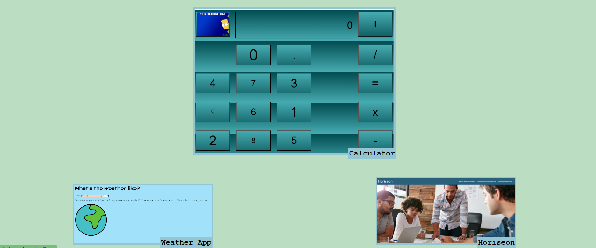
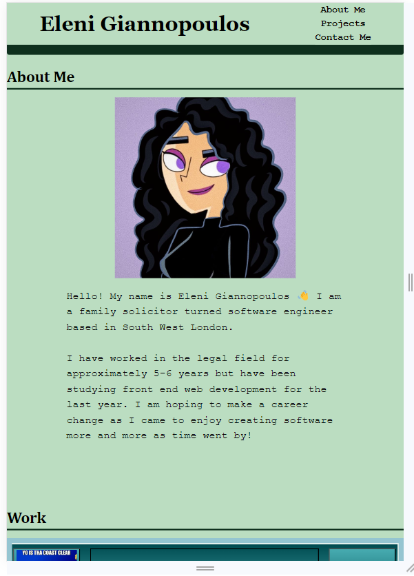
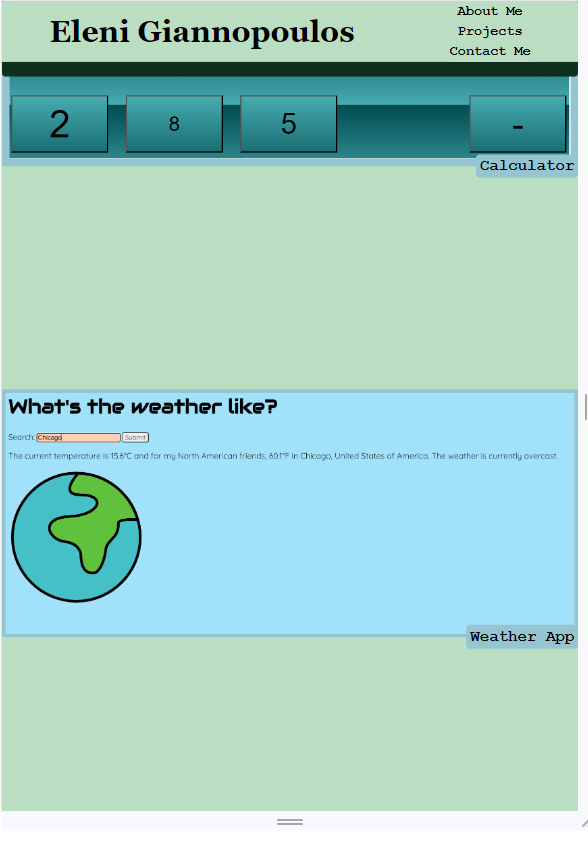

# Bootstrap-Portfolio

## Description

My aim with this project was to re-create my portfolio webpage, but by using components from the Bootstrap framework. It was important for the webpage to still inform users of information about me, to display my software development portfolio and to provide contact information about myself. I was able to adapt various components from Bootstrap to personalise them to my personal style but also highlight the information in an effective way. For example, by displaying each project on a card which allowed for a preview picture and text.

This project allowed me to practise using Bootstrap and customising elements on my webpage. I realised when it is necessary to use !important to overwrite default CSS styling with Bootstrap components. I also learned how to make my webpage responsive by using the 12-column grid, as opposed to using media queries. 

## Installation

N/A

## Usage

Visit the [Bootstrap Portfolio](https://elenimg.github.io/Bootstrap-Portfolio/) webpage.

Click any of the links in the navigation bar at the top to go to any of the corresponding sections in the webpage. 

You can click any of the images or headers in the Projects section, titled "Take a look at what I've been working on..." to open any of the deployed applications displayed.

You can also click any of the links in the 'Contact Me' section to send an email, view my GitHub or view my LinkedIn pages.

The Portfolio webpage is responsive, and so will adjust according to your screen size. Please see the following screenshots as an example:

## Credits

The following third-party assets were used to assist with this code:

[Grid Gaps - MDN](https://developer.mozilla.org/en-US/docs/Web/CSS/gap)

[Z-index - MDN](https://developer.mozilla.org/en-US/docs/Web/CSS/z-index)

[CSS Variables - W3 Schools](https://www.w3schools.com/css/css3_variables.asp#:~:text=To%20create%20a%20variable%20with,use%20the%20var()%20function.)

[How to create a sticky header - W3 Schools](https://www.w3schools.com/howto/howto_js_sticky_header.asp)

[Guide to CSS Flexbox - CSS-Tricks](https://css-tricks.com/snippets/css/a-guide-to-flexbox/)
